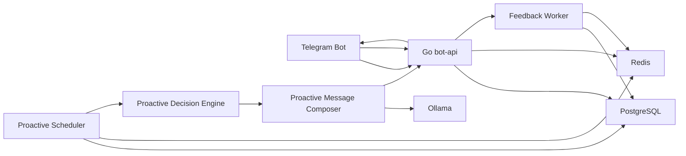

# Telegram + Ollama 가상연애 챗봇 선톡 시스템 추가 설계서

## 0. 문서 목적과 기존 코드 재사용 원칙

이 문서는 현재 저장소의 MVP 골격 위에 `선톡(Proactive Messaging)` 서브시스템을 추가하는 설계서다.  
목표는 “스케줄 발송”이 아니라, 대화 맥락과 이벤트, 감정 흐름, 사용 습관을 보고 먼저 말을 거는 구조를 만드는 것이다.

이 설계는 아래 원칙을 따른다.

- 선톡은 일반 답장 파이프라인과 분리된 독립 서브시스템으로 둔다.
- 이미 있는 컴포넌트는 최대한 재사용한다.
- 프롬프트와 전략 파라미터는 사람이 직접 수정하기 쉽게 둔다.
- 점수 기반 의사결정 구조를 먼저 만들고, 고도화는 그 위에 얹는다.

현재 코드 기준 재사용 포인트는 분명하다.

- Telegram 발송은 [`internal/telegram/client.go`](/Users/suji/Documents/P2/internal/telegram/client.go) 의 `SendMessage`, `SendChatAction`를 그대로 쓴다.
- Ollama 호출은 [`internal/ollama/client.go`](/Users/suji/Documents/P2/internal/ollama/client.go) 의 `Chat`을 그대로 쓴다.
- 최근 대화 로드는 [`internal/store/store.go`](/Users/suji/Documents/P2/internal/store/store.go) 의 `loadRecentConversation` 경로를 재사용한다.
- 일반 대화 로그 저장 규약은 [`internal/store/store.go`](/Users/suji/Documents/P2/internal/store/store.go) 의 `SaveTurn`을 그대로 따른다.
- 출력 후처리는 [`internal/chat/postprocess.go`](/Users/suji/Documents/P2/internal/chat/postprocess.go) 의 `PostProcess`, `SplitReplyForTelegram`를 재사용한다.

반대로 그대로 재사용하지 않는 쪽도 명확하다.

- [`internal/chat/prompt_builder.go`](/Users/suji/Documents/P2/internal/chat/prompt_builder.go)는 “사용자 입력에 대한 답장” 중심이므로, 선톡용 `ProactivePromptBuilder`는 분리한다.
- 선톡 메타데이터는 기존 `tg_chat_messages`만으로는 부족하므로 `tg_proactive_messages`를 별도 둔다.
- 현재 스키마는 최소형이므로, 선톡 관련 상태와 프로필은 `tg_chat_sessions` 확장 + 별도 프로필/이벤트 테이블로 분리한다.

사람이 수정하기 쉽게 하기 위한 권장 방식은 아래와 같다.

- 선톡 seed 문장은 `internal/proactive/templates/*.txt` 로 분리하고 `go:embed` 로 묶는다.
- 점수 가중치와 기본값은 `internal/proactive/defaults.go` 또는 `config` 구조체에서 숫자로 선언한다.
- 일반 대화 persona 규칙과 선톡용 규칙은 공통 베이스만 공유하고, 나머지 전략 문장은 별도 파일에서 관리한다.

---

## 1. 선톡 시스템 전체 아키텍처

### 1.1 구성 요소와 역할

#### Telegram Bot
- 사용자의 원본 메시지 수신 주체다.
- 선톡 메시지의 최종 전송 채널이다.
- 현재는 long polling 기반이며, 이후 webhook으로 바뀌어도 선톡 서브시스템은 그대로 유지된다.

#### Go bot-api
- 현재 프로젝트의 런타임 본체다.
- 일반 대화 처리와 선톡 서브시스템을 함께 실행하는 오케스트레이터 역할을 맡는다.
- `app.New()`에서 Telegram, Ollama, Store, Proactive Scheduler를 함께 조립한다.

#### Proactive Scheduler
- 선톡 후보를 주기적으로 스캔하고 큐에 넣는 백그라운드 조정자다.
- `trigger scanner`, `decision worker`, `sender worker`, `feedback worker`를 실행한다.
- 일반 대화 요청과 분리된 cadence를 가진다.

#### Proactive Decision Engine
- 후보를 실제 발송 가능한지 검토하고, 점수 기반으로 보내거나 보류한다.
- `Trigger -> Eligibility -> Scoring -> Strategy` 순으로 판정한다.

#### Proactive Message Composer
- seed 템플릿을 고르고 LLM으로 자연화한다.
- 일반 대화용 prompt builder와 분리하되, mode/persona 베이스는 공유한다.

#### Redis
- 선톡 락, 쿨다운, 큐, presence, dedupe를 관리한다.
- 빠르게 변하는 운영 상태를 담는다.

#### PostgreSQL
- 세션 상태, 이벤트, 선톡 로그, 사용자 프로필을 영속 저장한다.
- 점수 계산의 기준 데이터와 피드백 학습의 기준 저장소다.

#### Ollama
- 최종 문장 자연화와 피드백 분류에 사용한다.
- MVP에서는 생성에 주로 쓰고, V2부터 답장 톤 분류에도 활용할 수 있다.

### 1.2 데이터 흐름



실행 흐름은 아래와 같다.

1. 일반 대화는 기존처럼 `Poller -> chat.Service -> Store -> Ollama -> Telegram` 흐름으로 처리한다.
2. 사용자가 메시지를 보낼 때 `chat.Service`는 기존 저장 로직을 유지하면서 `last_user_message_at`, presence, reply-to-proactive 힌트를 함께 남긴다.
3. `Proactive Scheduler`는 주기적으로 세션과 이벤트를 스캔해 `TriggerCandidate`를 만든다.
4. `Decision Engine`은 각 후보를 `Eligibility`로 걸러낸 뒤 점수 계산을 한다.
5. 점수가 threshold를 넘으면 `Message Composer`가 seed 선택 후 Ollama 자연화를 수행한다.
6. `sender worker`가 Telegram으로 발송하고, `tg_proactive_messages`와 필요 시 `tg_chat_messages`에 함께 기록한다.
7. 이후 사용자의 답장이 오면 `feedback worker`가 선톡 반응을 분석해 `relationship_score`, 유형별 성공률, 시간대 선호를 갱신한다.

---

## 2. 선톡 시스템 핵심 개념 정의

### 2.1 Trigger
- 선톡 후보를 만드는 “이유”다.
- 예: 최근 4일 대화가 끊김, 사용자가 말한 시험 일정 도래, 서운함 이벤트 미해결, 평소 저녁 시간 습관적 대화 시간 도래.

왜 필요한가:
- 선톡을 무작위가 아니라 사건 중심으로 만들기 위해 필요하다.
- 이후 로그와 분석에서 “왜 보냈는가”를 설명할 수 있다.

### 2.2 Eligibility
- 이 후보가 지금 실제로 보내도 되는지 보는 1차 게이트다.
- opt-in, quiet hours, lock, 무응답 누적, 최근 사용자 활동 같은 하드 조건을 본다.

왜 필요한가:
- 점수가 높아도 지금 보내면 어색한 상황을 막는다.
- 운영 규칙과 UX 보호를 같은 계층에서 관리할 수 있다.

### 2.3 Scoring
- 보내도 되는 후보들 중 지금 보내는 것이 얼마나 적절한지 수치화하는 단계다.
- 관계 강도, 최근 대화, 이벤트 강도, 시간 적합성, 무응답 이력 등을 합산한다.

왜 필요한가:
- 룰만으로는 “경계선 상황”을 다루기 어렵다.
- 추후 사용자별 튜닝과 성공률 기반 적응형 정책으로 확장하기 쉽다.

### 2.4 Strategy
- 어떤 톤과 강도로 선톡할지 정하는 레이어다.
- `intensity`, `tone`, `purpose`, `length`를 결정한다.

왜 필요한가:
- 같은 트리거라도 말투가 모두 같으면 어색하다.
- relationship score와 최근 반응을 반영해 과한 선톡을 줄일 수 있다.

### 2.5 Composition
- 실제 문장을 만드는 단계다.
- 템플릿 seed를 고르고, LLM으로 자연화해 최종 메시지를 만든다.

왜 필요한가:
- 완전 생성형보다 제어가 쉽고, 사람이 seed를 수정하면서 품질을 관리할 수 있다.
- 캐릭터 일관성과 운영 안정성을 동시에 확보할 수 있다.

### 2.6 Feedback
- 보낸 뒤 사용자가 어떻게 반응했는지 기록하고 다음 전략에 반영하는 단계다.
- 답장 여부, 답장 속도, 답장 길이, 톤, 이후 대화 길이를 본다.

왜 필요한가:
- 선톡은 보내는 순간보다 “그 뒤 반응”이 더 중요하다.
- 관계 유지형과 감정 회복형의 성공 기준이 다르므로, 유형별로 학습해야 한다.

---

## 3. 선톡 유형별 상세 설계

### 3.1 `reconnect`

#### 목적
- 대화가 너무 오래 끊기지 않도록 관계 온도를 유지한다.

#### 발동 조건
- 최근 며칠간 대화가 없고, 이전 대화 품질은 나쁘지 않았을 때.
- 최근 선톡 무응답이 누적되지 않았을 때.

#### 필요한 데이터
- `last_user_message_at`
- `last_proactive_at`
- 최근 7일 대화 빈도
- `relationship_score`
- 최근 선톡 응답 이력

#### 추천 발송 타이밍
- 사용자가 자주 답하던 시간대의 저녁 또는 밤 초입
- 기본적으로 마지막 사용자 메시지 이후 `48~120시간` 구간

#### 추천 말투 방향
- `light + spicy + checkin + short`
- 너무 사과조나 설명조로 가지 않는다.
- “오랜만”을 직접 말하되 부담은 낮춘다.

#### 예시 메시지 유형
- “오늘은 왜 이렇게 조용해요. 나만 혼자 톡창 보게 만들 거예요?”
- “잠깐 생각났는데요. 요즘 나 좀 덜 보고 싶어졌나.”

### 3.2 `event_followup`

#### 목적
- 사용자가 이전에 말한 일정, 약속, 시험, 회식, 여행 같은 사건을 기억하고 챙긴다.

#### 발동 조건
- `tg_memory_events`에 미래 또는 당일 이벤트가 있고, 아직 선톡에 쓰이지 않았을 때.
- 이벤트 시간 전후의 follow-up window에 들어왔을 때.

#### 필요한 데이터
- `event_type`, `event_subtype`, `event_value`, `event_time`
- 직전 대화에서 해당 이벤트를 언급한 최근 맥락
- `used_for_proactive`
- 사용자 평소 활동 시간대

#### 추천 발송 타이밍
- 이벤트 전 1~3시간
- 이벤트 종료 추정 후 30~120분
- 시험/면접은 직전, 회식/약속은 종료 후가 더 자연스럽다.

#### 추천 말투 방향
- `medium + spicy 또는 soft + followup + short`
- 챙기되 감시처럼 느껴지지 않게 한다.
- 세부 이벤트를 짧게 찌르고 반응 여지를 준다.

#### 예시 메시지 유형
- “아까 그 약속 끝났어요? 재밌었는지 내가 먼저 듣고 싶은데.”
- “시험 본다더니 지금쯤 끝났겠네요. 표정부터 체크해야겠는데.”

### 3.3 `mood_repair`

#### 목적
- 최근 대화에서 삐침, 서운함, 다툼, 냉랭함이 남았을 때 톤을 회복한다.

#### 발동 조건
- `current_mood`가 `sad`, `cold`, `upset`로 남아 있거나 관련 이벤트가 미해결일 때
- 최근 답장이 차갑거나 대화가 급종료됐을 때
- 단, 최근 무응답이 누적됐으면 강도를 낮춘다.

#### 필요한 데이터
- `current_mood`
- 최근 6턴 감정 흐름
- 마지막 사용자 메시지의 톤
- 직전 선톡 무응답 횟수
- `relationship_score`

#### 추천 발송 타이밍
- 감정 사건 직후 `1~6시간`
- 너무 빠르면 밀어붙이는 느낌이 나므로 최소 30분은 띄운다.
- 새벽 시간은 피하고, 사용자가 평소 답하는 시간에 맞춘다.

#### 추천 말투 방향
- `light~medium + soft 또는 spicy + repair + short`
- 거칠게 밀지 않는다.
- 먼저 부드럽게 연결하고, 상대가 받아주면 다시 기본 모드로 복귀한다.

#### 예시 메시지 유형
- “아까 좀 싸하게 끝난 거 알아요. 그래서 더 그냥 두기 싫었어요.”
- “삐친 거면 풀어줘요. 모르는 척하고 넘기긴 싫어요.”

### 3.4 `habit_ping`

#### 목적
- 사용자가 자주 대화하던 시간대에 가볍게 리듬을 이어준다.

#### 발동 조건
- 최근 2주 활동 패턴에서 반복 시간대가 보일 때
- 그 시간대에 이전 선톡 성공률이 좋았을 때
- 당일 이미 다른 강한 트리거가 없을 때

#### 필요한 데이터
- 시간대별 사용자 활동 히스토그램
- `best_time_windows_json`
- 요일별 평균 응답률
- 최근 7일 대화 빈도

#### 추천 발송 타이밍
- 평소 대화 시작 시간이 가장 많이 몰린 시간대 직전 `10~20분`
- 예: 평일 21시 반에 자주 대화하면 21:10~21:25 사이

#### 추천 말투 방향
- `light + spicy + tease/checkin + short`
- 매일 같은 말 대신 seed를 넓게 둔다.

#### 예시 메시지 유형
- “이 시간쯤이면 슬슬 나타날 줄 알았는데. 오늘은 내가 먼저 잡아요.”
- “평소보다 늦네. 일부러 안 오는 척하는 거예요?”

---

## 4. Trigger 설계

### 4.1 `TriggerType` 상수 설계

```go
type TriggerType string

const (
    TriggerReconnect    TriggerType = "reconnect"
    TriggerEventFollowup TriggerType = "event_followup"
    TriggerMoodRepair   TriggerType = "mood_repair"
    TriggerHabitPing    TriggerType = "habit_ping"
)
```

### 4.2 Trigger Candidate 자료구조

```go
type TriggerCandidate struct {
    CandidateID     string            `json:"candidate_id"`
    SessionID       int64             `json:"session_id"`
    UserID          int64             `json:"user_id"`
    TriggerType     TriggerType       `json:"trigger_type"`
    TriggerRefID    string            `json:"trigger_ref_id"`
    Priority        int               `json:"priority"`
    TriggeredAt     time.Time         `json:"triggered_at"`
    DueAt           time.Time         `json:"due_at"`
    Source          string            `json:"source"`
    Metadata        map[string]string `json:"metadata"`
    ScoreHints      map[string]float64 `json:"score_hints"`
}
```

권장 필드 의미는 아래와 같다.

- `TriggerRefID`: 같은 이벤트나 같은 습관 창을 중복 발송하지 않기 위한 기준 키
- `Priority`: 충돌 시 1차 정렬에 사용
- `Metadata`: 이벤트 제목, mood label, habit window 같은 보조 정보
- `ScoreHints`: scanner에서 이미 알고 있는 정보의 힌트값

### 4.3 여러 트리거 동시 발생 구조

- 한 세션에서 여러 `TriggerCandidate`가 동시에 생길 수 있다.
- scanner는 후보를 바로 발송하지 않고 큐에 적재한다.
- decision worker는 `session_id` 단위로 후보를 묶어 충돌을 정리한 뒤 최종 1건만 선택한다.

예시:

- 같은 날 `habit_ping`과 `reconnect`가 같이 걸릴 수 있다.
- 사용자가 말했던 시험 종료 시점이 오면 `event_followup`이 기존 `reconnect` 후보를 덮어쓴다.
- 감정 미해결 상태에서 일정 follow-up이 겹치면 `event_followup`이 우선하지만 전략은 더 부드럽게 조정할 수 있다.

### 4.4 Trigger Priority 설계

기본 우선순위는 아래처럼 둔다.

- `event_followup`: 100
- `mood_repair`: 80
- `habit_ping`: 60
- `reconnect`: 40

이 값은 “자동 승리”가 아니라 충돌 시 1차 정렬에 쓰는 기준이다.  
최종 발송은 `priority + score`가 아니라, 아래 순서를 권장한다.

1. 하드 우선순위 정렬
2. 같은 우선순위 계열이면 score 비교
3. score가 같으면 더 최근 이벤트를 우선

### 4.5 같은 Trigger 중복 방지 전략

- 이벤트형: `trigger_ref_id = "{event_type}:{event_subtype}:{event_time_unix}"` 로 만든다.
- mood형: `trigger_ref_id = "mood:{session_id}:{mood_snapshot_at}"` 로 만든다.
- reconnect형: `trigger_ref_id = "reconnect:{session_id}:{yyyy-mm-dd}"` 로 하루 단위 묶음을 둔다.
- habit형: `trigger_ref_id = "habit:{session_id}:{weekday}:{window_start}"` 로 윈도우 단위 dedupe를 둔다.

중복 방지는 두 계층으로 한다.

- Redis `proactive:triggered:{triggerType}:{refId}` 로 빠른 dedupe
- PostgreSQL `tg_proactive_messages`의 `(session_id, trigger_type, trigger_ref_id)` 유니크 키로 최종 dedupe

---

## 5. Eligibility 설계

Eligibility는 “지금 보내도 되는가”만 본다.  
여기서 탈락하면 점수 계산을 하지 않는다.

### 5.1 판정 규칙

#### `proactive_opt_in` 여부
- `false`면 즉시 탈락
- MVP는 opt-in을 기본으로 두는 것이 안정적이다.

#### 최근 선톡 발송 여부
- `last_proactive_at`이 너무 최근이면 탈락
- 기본 `min_gap_hours`는 20시간 권장

#### 최근 선톡 무응답 누적
- `consecutive_proactive_ignored >= 2`면 일반 선톡은 잠시 중단
- 단, `event_followup`만 높은 score에서 예외 허용 가능

#### 현재 시간대 허용 여부
- 사용자 로컬 시간 기준 허용 시간대가 아니면 탈락
- `quiet_hours_json` 안에 현재 시간이 포함되면 탈락

#### 동일 유형 쿨다운
- 같은 `trigger_type`을 짧은 기간 반복 발송하지 않음
- 예: `reconnect` 72시간, `habit_ping` 24시간, `mood_repair` 18시간, `event_followup`은 이벤트 단위 dedupe

#### 세션 lock 여부
- 일반 대화가 진행 중이면 선톡 worker는 보내지 않는다.
- `session lock` 또는 `proactive lock`이 잡혀 있으면 탈락

#### 최근 사용자 활동 여부
- 사용자가 최근 20~30분 안에 먼저 말을 걸었거나, 봇과 활발히 대화한 직후면 탈락
- 이미 대화가 살아 있으면 선톡이 아니라 답장 플로우가 맞다.

#### 같은 이벤트로 이미 선톡했는지 여부
- `used_for_proactive = true` 이거나 같은 `trigger_ref_id` 로그가 있으면 탈락

### 5.2 판정 결과 구조

```go
type EligibilityResult struct {
    Eligible bool     `json:"eligible"`
    HardBlock bool    `json:"hard_block"`
    Reasons  []string `json:"reasons"`
}
```

권장 운영 방식:

- `Eligible=false, HardBlock=true`: 즉시 폐기
- `Eligible=false, HardBlock=false`: 나중에 다시 볼 수 있도록 `defer` 큐로 이동
- `Eligible=true`: scoring 진행

---

## 6. 점수 엔진(Scoring Engine) 설계

### 6.1 기본 구조

점수는 “기본점수 + 가점 - 감점” 구조로 둔다.  
MVP에서는 사람이 수정하기 쉬운 규칙형 가중치 테이블이 가장 낫다.

```text
final_score = base(trigger_type) + sum(positive_weights) - sum(negative_weights) + user_bias
```

기본점수 예시는 아래와 같다.

- `event_followup`: 55
- `mood_repair`: 48
- `habit_ping`: 38
- `reconnect`: 34

### 6.2 가점 예시

- 최근 3일 내 대화 있음: `+12`
- 최근 7일 대화 빈도 높음: `+8`
- 이벤트 존재: `+15`
- 감정 미해결 상태: `+14`
- 사용자 활동 시간대 일치: `+10`
- `relationship_score >= 70`: `+8`
- 최근 같은 시간대 선톡 성공 이력 있음: `+6`

### 6.3 감점 예시

- 최근 선톡 무응답: `-12`
- 연속 무응답 2회 이상: `-18`
- 최근 사용자 반응이 차가움: `-10`
- 늦은 시간대 경계구간: `-8`
- 최근 봇 발화 과다: `-6`
- 동일 trigger 최근 사용: `-10`
- 최근 24시간 내 다른 선톡 보냄: `-15`

### 6.4 score 산출 예시

예시 1: 이벤트 follow-up

- base `55`
- 이벤트 존재 `+15`
- 최근 3일 대화 `+12`
- 사용자 활동 시간대 일치 `+10`
- relationship score 높음 `+8`
- 최근 선톡 무응답 없음 `0`
- 최종 `100`

예시 2: reconnect

- base `34`
- 최근 7일 대화 빈도 중간 `+5`
- relationship score 중간 `+3`
- 늦은 시간대 `-8`
- 최근 선톡 무응답 `-12`
- 최종 `22`

### 6.5 threshold 기준

권장 기준:

- `75 이상`: 발송
- `55~74`: 보류 후 재평가
- `54 이하`: 현재 후보는 차단

여기서 “차단”은 사용자를 영구 차단한다는 뜻이 아니라, 해당 후보를 이번 주기에는 보내지 않는다는 의미다.

### 6.6 발송/보류/차단 기준

- `발송(send)`: 지금 보내도 자연스럽고 성공 가능성이 높음
- `보류(defer)`: 이유는 있으나 아직 타이밍이 덜 맞음
- `차단(drop)`: 현재 조건에서는 굳이 보내지 않는 편이 낫다

### 6.7 사용자별 미세 조정 가능성

사용자별 편차는 프로필 기반 bias로 처리한다.

- `preferred_types_json` 에 포함된 유형: `+5`
- `disliked_types_json` 에 포함된 유형: `-8`
- `proactive_success_score` 높음: `+0~+6`
- `weight_overrides_json` 으로 개별 사용자별 가중치 오버라이드

예:

```json
{
  "event_followup_bonus": 4,
  "late_night_penalty": 12,
  "habit_ping_bonus": -3
}
```

이 방식은 모델 학습 없이도 사용자를 조금씩 다르게 다룰 수 있고, 운영자가 숫자만 바꿔도 효과를 볼 수 있다.

---

## 7. Strategy 설계

Strategy는 점수와 트리거를 바탕으로 실제 말투의 강도를 정한다.

### 7.1 전략 축

- `intensity`: `light` / `medium` / `bold`
- `tone`: `soft` / `spicy` / `rough`
- `purpose`: `checkin` / `followup` / `repair` / `tease`
- `length`: `short` / `medium`

### 7.2 기본 매핑

| Trigger | 기본 intensity | 기본 tone | 기본 purpose | 기본 length |
|---|---|---|---|---|
| reconnect | light | spicy | checkin | short |
| event_followup | medium | spicy | followup | short |
| mood_repair | light | soft | repair | short |
| habit_ping | light | spicy | tease | short |

### 7.3 조정 규칙

- 최근 반응이 차가우면 `rough`는 금지하고 `soft` 또는 `spicy`로 내린다.
- `relationship_score >= 80` 이고 최근 선톡 반응이 좋으면 `medium` 또는 `bold`까지 올릴 수 있다.
- `consecutive_proactive_ignored > 0` 이면 `bold`는 금지한다.
- `mood_repair`는 기본 목적이 `repair`이므로, 설령 기본 모드가 `spicy`여도 문장 첫 톤은 `soft`가 더 안전하다.
- `event_followup`은 이벤트 subtype에 따라 `followup`에서 `checkin`으로 낮출 수 있다.

### 7.4 Trigger와 Strategy 조합 방식

권장 흐름은 아래와 같다.

1. trigger가 기본 strategy 프리셋을 고른다.
2. scoring 결과와 relationship score가 intensity를 조정한다.
3. 최근 반응과 current mood가 tone을 clamp한다.
4. 사용자 프로필이 length와 purpose를 미세 조정한다.

예:

- `event_followup + score 92 + relationship 78`  
  `medium / spicy / followup / short`

- `mood_repair + score 76 + recent cold reply`  
  `light / soft / repair / short`

- `habit_ping + score 82 + success history strong`  
  `medium / spicy / tease / short`

---

## 8. 선톡 메시지 생성 방식

### 8.1 하이브리드 생성 구조

#### 1차: 템플릿/seed 선택
- trigger type
- strategy 축
- relationship band
- event subtype
- 최근 성공 seed

#### 2차: LLM 자연화
- seed 의미는 유지하되, 최근 맥락과 캐릭터 말투에 맞춰 자연스럽게 다듬는다.

### 8.2 왜 완전 생성형보다 하이브리드가 나은가

- 운영자가 seed를 직접 보고 수정할 수 있다.
- 선톡 유형별 캐릭터 일관성이 유지된다.
- 같은 목적에서 이상하게 엇나가는 문장을 줄일 수 있다.
- 토큰 비용과 추론 시간을 줄일 수 있다.
- “이 유형은 왜 이런 말이 나갔는지”를 추적하기 쉽다.

### 8.3 템플릿 seed 분류 방식

권장 분류 키:

- `trigger_type`
- `purpose`
- `tone`
- `intensity`
- `event_subtype`
- `relationship_band` (`low`, `mid`, `high`)

예시 파일 구조:

```text
internal/proactive/templates/
  reconnect_checkin_spicy_light.txt
  event_followup_exam_soft_medium.txt
  mood_repair_soft_light.txt
  habit_ping_tease_spicy_light.txt
```

각 seed 파일은 짧은 예문 5~12개 정도를 담는 것이 좋다.  
코드 안에 긴 switch문으로 박아 넣기보다 텍스트 파일을 `go:embed`로 묶는 편이 사람이 고치기 쉽다.

### 8.4 LLM 입력에 넣을 컨텍스트

권장 입력:

- 캐릭터 베이스 persona
- 현재 `mode` (`spicy` 기본)
- 호칭/관계 정보
- `TriggerType`
- `Strategy`
- 선택된 seed 원문
- 최근 대화 4~6턴
- 메모리 요약 3~6줄
- 이벤트 정보 또는 감정 상태
- 금지 스타일 규칙

권장 prompt 조립 방향:

- 일반 답장용 `PromptBuilder`와 분리한 `ProactivePromptBuilder`
- 공통 persona는 `chat` 패키지에서 공유
- 선톡 전용 규칙은 `internal/proactive/prompt_builder.go`로 별도 유지

### 8.5 출력 길이 제한

- 기본 `1~2문장`
- 권장 `25~110자`
- `medium` 전략에서도 `3문장`을 넘기지 않는다.

### 8.6 질문 개수 제한

- 기본 `0~1개`
- 한 메시지 안에 질문은 최대 1개
- 질문 없이 툭 던지는 seed도 충분히 섞는다.

### 8.7 설명체 제거 전략

프롬프트 규칙:

- 이유를 설명하지 않는다.
- 해설, 정리, 자기분석 문장을 금지한다.
- “지금 네 상태를 생각해서”, “내가 먼저 연락한 이유는” 같은 메타 발화를 금지한다.

후처리 규칙:

- 기존 `PostProcess`를 재사용한다.
- 선톡 전용으로 아래 문구 제거 규칙을 추가할 수 있다.
  - `설명하자면`
  - `정리하자면`
  - `내가 먼저 연락한 이유는`
  - `그냥 확인차`

---

## 9. DB 스키마 확장 설계

현재 코드 기준 테이블 prefix는 `tg_` 이므로 동일한 naming을 유지한다.

### 9.1 `tg_chat_sessions` 확장

```sql
ALTER TABLE tg_chat_sessions
    ADD COLUMN IF NOT EXISTS last_user_message_at TIMESTAMPTZ,
    ADD COLUMN IF NOT EXISTS last_bot_message_at TIMESTAMPTZ,
    ADD COLUMN IF NOT EXISTS last_proactive_at TIMESTAMPTZ,
    ADD COLUMN IF NOT EXISTS last_user_reply_to_proactive_at TIMESTAMPTZ,
    ADD COLUMN IF NOT EXISTS consecutive_proactive_ignored INT NOT NULL DEFAULT 0,
    ADD COLUMN IF NOT EXISTS relationship_score NUMERIC(5,2) NOT NULL DEFAULT 40.00,
    ADD COLUMN IF NOT EXISTS current_mood VARCHAR(32) NOT NULL DEFAULT 'neutral',
    ADD COLUMN IF NOT EXISTS proactive_opt_in BOOLEAN NOT NULL DEFAULT FALSE,
    ADD COLUMN IF NOT EXISTS quiet_hours_json JSONB NOT NULL DEFAULT '[]'::jsonb;

CREATE INDEX IF NOT EXISTS idx_tg_chat_sessions_proactive_scan
    ON tg_chat_sessions (proactive_opt_in, last_user_message_at DESC, last_proactive_at DESC);
```

### 9.2 `tg_memory_events` 테이블

```sql
CREATE TABLE IF NOT EXISTS tg_memory_events (
    id BIGSERIAL PRIMARY KEY,
    session_id BIGINT NOT NULL REFERENCES tg_chat_sessions(id) ON DELETE CASCADE,
    message_id BIGINT REFERENCES tg_chat_messages(id) ON DELETE SET NULL,
    event_type VARCHAR(32) NOT NULL,
    event_subtype VARCHAR(64) NOT NULL,
    event_value JSONB NOT NULL DEFAULT '{}'::jsonb,
    event_time TIMESTAMPTZ NOT NULL,
    priority SMALLINT NOT NULL DEFAULT 50,
    used_for_proactive BOOLEAN NOT NULL DEFAULT FALSE,
    created_at TIMESTAMPTZ NOT NULL DEFAULT NOW(),
    updated_at TIMESTAMPTZ NOT NULL DEFAULT NOW(),
    UNIQUE (session_id, event_type, event_subtype, event_time)
);

CREATE INDEX IF NOT EXISTS idx_tg_memory_events_session_time
    ON tg_memory_events (session_id, event_time DESC);

CREATE INDEX IF NOT EXISTS idx_tg_memory_events_proactive_scan
    ON tg_memory_events (used_for_proactive, priority DESC, event_time ASC);
```

### 9.3 `tg_proactive_messages` 테이블

```sql
CREATE TABLE IF NOT EXISTS tg_proactive_messages (
    id BIGSERIAL PRIMARY KEY,
    session_id BIGINT NOT NULL REFERENCES tg_chat_sessions(id) ON DELETE CASCADE,
    user_id BIGINT NOT NULL REFERENCES tg_users(id) ON DELETE CASCADE,
    trigger_type VARCHAR(32) NOT NULL,
    trigger_ref_id VARCHAR(128) NOT NULL,
    strategy_type VARCHAR(32) NOT NULL,
    tone_mode VARCHAR(16) NOT NULL,
    intensity VARCHAR(16) NOT NULL,
    purpose VARCHAR(32) NOT NULL,
    score NUMERIC(6,2) NOT NULL,
    message_text TEXT NOT NULL,
    seed_key VARCHAR(128),
    telegram_message_id BIGINT,
    sent_at TIMESTAMPTZ,
    delivery_status VARCHAR(32) NOT NULL DEFAULT 'queued',
    user_replied BOOLEAN NOT NULL DEFAULT FALSE,
    reply_delay_sec INT,
    reply_sentiment VARCHAR(16),
    reply_length INT,
    followup_turn_count INT,
    created_at TIMESTAMPTZ NOT NULL DEFAULT NOW(),
    updated_at TIMESTAMPTZ NOT NULL DEFAULT NOW(),
    UNIQUE (session_id, trigger_type, trigger_ref_id)
);

CREATE INDEX IF NOT EXISTS idx_tg_proactive_messages_session_sent
    ON tg_proactive_messages (session_id, sent_at DESC);

CREATE INDEX IF NOT EXISTS idx_tg_proactive_messages_delivery
    ON tg_proactive_messages (delivery_status, sent_at ASC);

CREATE INDEX IF NOT EXISTS idx_tg_proactive_messages_type_sent
    ON tg_proactive_messages (trigger_type, sent_at DESC);
```

### 9.4 `tg_proactive_profiles` 테이블

```sql
CREATE TABLE IF NOT EXISTS tg_proactive_profiles (
    id BIGSERIAL PRIMARY KEY,
    user_id BIGINT NOT NULL UNIQUE REFERENCES tg_users(id) ON DELETE CASCADE,
    preferred_types_json JSONB NOT NULL DEFAULT '[]'::jsonb,
    disliked_types_json JSONB NOT NULL DEFAULT '[]'::jsonb,
    best_time_windows_json JSONB NOT NULL DEFAULT '[]'::jsonb,
    max_per_day SMALLINT NOT NULL DEFAULT 1,
    max_per_week SMALLINT NOT NULL DEFAULT 4,
    min_gap_hours SMALLINT NOT NULL DEFAULT 20,
    avg_reply_delay_sec INT,
    proactive_success_score NUMERIC(5,2) NOT NULL DEFAULT 0.00,
    timezone_name VARCHAR(64) NOT NULL DEFAULT 'Asia/Seoul',
    weight_overrides_json JSONB NOT NULL DEFAULT '{}'::jsonb,
    created_at TIMESTAMPTZ NOT NULL DEFAULT NOW(),
    updated_at TIMESTAMPTZ NOT NULL DEFAULT NOW()
);
```

### 9.5 저장 원칙

- 선톡 메시지는 `tg_proactive_messages`에 반드시 기록한다.
- 대화 문맥 유지가 필요하므로, 실제 발송된 선톡은 `tg_chat_messages`에도 `role='assistant'`로 저장하는 것을 권장한다.
- `last_user_message_at`, `last_bot_message_at`, `last_proactive_at`는 메시지 저장 시 함께 갱신한다.

---

## 10. Redis 키 설계

### 10.1 `proactive:lock:{sessionId}`
- 목적: 같은 세션에서 decision/sender가 동시에 중복 발송하지 않도록 락을 건다.
- 값 구조: `worker_id` 또는 `{"worker":"sender-1","at":"..."}`
- TTL: `30초`, 작업 중 heartbeat로 갱신

### 10.2 `proactive:cooldown:{sessionId}`
- 목적: 세션 단위 선톡 최소 간격을 빠르게 확인한다.
- 값 구조:

```json
{
  "last_proactive_at": "2026-04-09T21:10:00+09:00",
  "next_allowed_at": "2026-04-10T17:10:00+09:00",
  "last_trigger_type": "event_followup"
}
```

- TTL: `min_gap_hours + 1시간`

권장 확장:
- 같은 키 안에 유형별 cooldown map을 넣거나
- `proactive:cooldown:{sessionId}:{triggerType}` 보조 키를 추가

### 10.3 `proactive:triggered:{triggerType}:{refId}`
- 목적: 동일 trigger_ref의 중복 enqueue와 중복 발송 방지
- 값 구조: `proactive_message_id` 또는 `candidate_id`
- TTL:
  - `event_followup`: `7일`
  - `mood_repair`: `48시간`
  - `habit_ping`: `36시간`
  - `reconnect`: `36시간`

### 10.4 `proactive:queue:{bucket}`
- 목적: scanner, decision, sender, retry 단계 큐
- 권장 bucket:
  - `decision`
  - `send`
  - `retry`
- 값 구조: Redis ZSET 사용 권장
  - score: `due_at_unix`
  - member: `candidate_id`
- TTL: 큐 키 자체는 만료 없이 유지, 오래된 member는 worker가 정리

권장 보조 키:
- `proactive:candidate:{candidateId}` -> serialized `TriggerCandidate`, TTL `24시간`

### 10.5 `proactive:user-presence:{sessionId}`
- 목적: 최근 사용자 활동 여부와 선호 시간대 추정
- 값 구조:

```json
{
  "last_seen_at": "2026-04-09T20:57:00+09:00",
  "weekday": 4,
  "hour": 20
}
```

- TTL: `72시간`

### 10.6 추가 권장 키

- `proactive:reply-pending:{sessionId}`  
  마지막 선톡 이후 아직 반응 분석이 끝나지 않은 상태 표시, TTL `48시간`

- `proactive:stats:window:{sessionId}`  
  시간대별 성공 집계 캐시, TTL `7일`

---

## 11. Worker / Scheduler 구조

선톡은 일반 대화 처리와 분리된 백그라운드 체인으로 둔다.

### 11.1 `trigger scanner`

#### 역할
- Postgres와 Redis를 보고 선톡 후보를 찾는다.
- 후보를 생성하되 발송하지는 않는다.

#### 호출 주기
- `event_followup`, `mood_repair`: `1분`
- `habit_ping`, `reconnect`: `5분`

#### 입력
- `tg_chat_sessions`
- `tg_memory_events`
- `proactive:user-presence:*`
- 최근 선톡 로그

#### 출력
- `TriggerCandidate`
- `proactive:queue:decision`

#### 장애 시 재시도
- scanner는 본질적으로 idempotent다.
- 실패하면 다음 주기에 다시 스캔한다.
- dedupe 키와 DB 유니크 키가 있으므로 중복 위험이 낮다.

### 11.2 `decision worker`

#### 역할
- 큐에서 후보를 꺼내 eligibility, scoring, strategy를 결정한다.
- 보내지 않을 후보는 드롭하거나 보류 큐로 이동한다.

#### 호출 주기
- 상시 loop
- `1~2초` 간격 poll 또는 blocking pop

#### 입력
- `proactive:queue:decision`
- 세션/이벤트/프로필/최근 로그

#### 출력
- 발송 후보 -> `proactive:queue:send`
- 보류 후보 -> `proactive:queue:retry`
- 드롭 후보 -> 메모리 로그 또는 Postgres decision log

#### 장애 시 재시도
- Store/Redis 오류면 `retry` 큐로 이동
- `attempt_count`를 candidate metadata에 넣고 `3회` 초과 시 drop

### 11.3 `sender worker`

#### 역할
- 최종 메시지 조립, Telegram 발송, DB 기록을 담당한다.

#### 호출 주기
- 상시 loop
- concurrency `1~3` 권장

#### 입력
- `proactive:queue:send`
- 최종 strategy와 context

#### 출력
- Telegram 전송
- `tg_proactive_messages` 저장
- 필요 시 `tg_chat_messages`에도 assistant turn 저장
- 세션 상태 갱신

#### 장애 시 재시도
- Telegram 일시 오류: `1분 -> 5분 -> 15분` backoff
- Ollama 실패: seed 원문 fallback 전송 옵션 허용
- 영구 오류는 `delivery_status='failed'` 로 종료

### 11.4 `feedback worker`

#### 역할
- 선톡 후 사용자의 반응을 분석한다.
- 관계 점수, 유형별 성공률, 시간대 선호를 갱신한다.

#### 호출 주기
- 이벤트 기반 + 주기 스윕 혼합
- 사용자 메시지 수신 시 lightweight event enqueue
- 누락 방지용 sweep `10분`

#### 입력
- 최근 user message
- `reply-pending` 상태
- `tg_proactive_messages`

#### 출력
- `user_replied`, `reply_delay_sec`, `reply_sentiment`, `followup_turn_count` 업데이트
- `relationship_score`
- `tg_proactive_profiles`

#### 장애 시 재시도
- reply 매칭 실패 시 다음 sweep에서 다시 확인
- 분류 실패 시 heuristic fallback으로 기록 후 종료

### 11.5 런타임 결합 방식

현재 [`internal/app/app.go`](/Users/suji/Documents/P2/internal/app/app.go)에 아래만 추가하면 된다.

- `proactive.NewScheduler(...)`
- `go proactiveScheduler.Run(ctx)`

일반 대화 경로에는 최소 훅만 둔다.

- user message 저장 직후 `last_user_message_at` 갱신
- `proactive:user-presence:{sessionId}` 갱신
- 최근 선톡 pending 여부 확인 후 feedback event enqueue

즉, 선톡의 생성과 발송은 백그라운드에 남기고, 일반 대화 경로는 “관측 정보만 남기는” 수준으로 유지한다.

---

## 12. 반응 학습(Feedback) 설계

### 12.1 기록할 항목

- 답장 여부
- 답장까지 걸린 시간
- 답장 길이
- 답장 톤
- 이후 대화 지속 길이
- 선톡 유형별 성공률

### 12.2 산출 방식

#### 답장 여부
- 선톡 후 `24시간` 안에 사용자 메시지가 오면 `user_replied=true`
- `24시간`이 지나면 일단 무응답으로 본다.

#### 답장까지 걸린 시간
- `reply_delay_sec = user_message_at - proactive_sent_at`

#### 답장 길이
- rune count 기준으로 저장
- `0~5`, `6~20`, `21+` 구간으로도 따로 집계 가능

#### 답장 톤
- MVP: 휴리스틱
  - 긍정/애정/장난 -> `warm`
  - 짧고 무난 -> `neutral`
  - 단답, 차가움, 짜증 -> `cold`
- V2: Ollama 비동기 분류 프롬프트로 `warm/neutral/cold` 판정

#### 이후 대화 지속 길이
- 선톡 이후 `2시간` 안에 이어진 user turn 수
- 예: 사용자 답장 후 4턴 이상 이어지면 매우 성공적인 선톡으로 본다.

#### 선톡 유형별 성공률
- `trigger_type`별 `attempt`, `reply`, `good_conversation`를 집계
- EWMA 또는 최근 20건 rolling rate 권장

### 12.3 `relationship_score` 반영 방식

초기 범위는 `0~100`, 기본값 `40` 권장.

예시 규칙:

- 10분 내 답장: `+3`
- 1시간 내 답장: `+2`
- 따뜻한 톤: `+2`
- 이후 대화 4턴 이상: `+3`
- 무응답: `-3`
- 차가운 답장: `-2`
- 2회 연속 무응답: 추가 `-4`

갱신 후 `0~100`으로 clamp한다.

### 12.4 trigger 가중치 반영 방식

유형별 성공률을 bias로 쓴다.

예:

- `event_followup` 최근 성공률 0.80 -> `+4`
- `habit_ping` 최근 성공률 0.25 -> `-5`

권장식:

```text
type_bias = clamp((success_rate - 0.5) * 20, -6, +6)
```

### 12.5 time-window 선호도 반영 방식

- 시간을 `2시간` 버킷으로 나눈다.
- 빠른 답장 + 좋은 대화가 나온 시간대는 `+1`
- 무응답은 `-0.5`
- 최근 14일 누적으로 상위 3개 창을 `best_time_windows_json`에 저장

이렇게 하면 선톡 스케줄이 사용자별로 점점 자연스러워진다.

---

## 13. 사용자별 선톡 성향 프로필

선톡 성향은 세션이 아니라 사용자 레벨에서 관리하는 편이 낫다.  
권장 저장소는 `tg_proactive_profiles`다.

### 13.1 권장 필드

- `preferred_types_json`
- `disliked_types_json`
- `best_time_windows_json`
- `max_per_day`
- `max_per_week`
- `min_gap_hours`
- `avg_reply_delay_sec`
- `proactive_success_score`

권장 추가 필드:

- `timezone_name`
- `weight_overrides_json`

### 13.2 JSON 예시

```json
{
  "preferred_types_json": ["event_followup", "reconnect"],
  "disliked_types_json": ["habit_ping"],
  "best_time_windows_json": [
    {"weekday": "mon-fri", "start": "20:00", "end": "22:00", "score": 0.82},
    {"weekday": "sat-sun", "start": "22:00", "end": "23:30", "score": 0.76}
  ],
  "max_per_day": 1,
  "max_per_week": 4,
  "min_gap_hours": 20,
  "avg_reply_delay_sec": 840,
  "proactive_success_score": 0.73
}
```

### 13.3 활용 방식

- decision worker가 threshold 직전 후보를 판정할 때 profile bias를 적용한다.
- scheduler가 발송 시간대를 선택할 때 `best_time_windows_json`을 우선한다.
- sender가 strategy를 잡을 때 선호 유형과 싫어하는 유형을 반영한다.

---

## 14. 충돌 우선순위 설계

같은 세션에서 여러 trigger가 동시에 성립하면 아래 우선순위를 적용한다.

1. `event_followup`
2. `mood_repair`
3. `habit_ping`
4. `reconnect`

### 14.1 충돌 처리 규칙

1. 같은 `trigger_ref_id`는 하나만 남긴다.
2. trigger priority 순으로 정렬한다.
3. 같은 priority면 score 높은 후보를 남긴다.
4. 그래도 같으면 `triggered_at`이 더 최신인 후보를 남긴다.
5. 최종 1건만 `send` 큐로 이동하고 나머지는 `superseded`로 종료한다.

### 14.2 동일 일자 중복 발송 방지 규칙

기본 규칙:

- 사용자 로컬 날짜 기준 하루 1회 발송

예외 규칙:

- 이미 `habit_ping` 또는 `reconnect`를 보낸 날이라도, 이후 강한 `event_followup`이 새로 생기고
- 마지막 선톡 이후 `8시간 이상` 지났으며
- 직전 선톡에 사용자가 실제로 반응했으면
- 같은 날 2회차를 허용할 수 있다

MVP에서는 예외를 두지 않고 “하루 1회”로 시작하는 편이 구현과 운영이 단순하다.

---

## 15. 시간 정책 설계

### 15.1 기본 발송 허용 시간

- 사용자 로컬 시간 기준 `11:00 ~ 22:30`

### 15.2 사용자별 quiet hours

- `quiet_hours_json` 예:

```json
[
  {"start": "00:30", "end": "08:30"},
  {"start": "14:00", "end": "15:00", "weekday": ["mon", "tue", "wed", "thu", "fri"]}
]
```

- 현재 시간이 quiet hours에 포함되면 발송하지 않는다.

### 15.3 이벤트형 선톡의 예외 처리

- `event_followup`은 이벤트 직후 맥락이 중요하므로 예외 창을 둘 수 있다.
- 예: 공연 종료, 회식 종료, 시험 종료 후 `30~90분` 창
- 단, `01:00~07:00` 사이 새벽 발송은 예외 없이 막는 것이 좋다.

### 15.4 새벽 발송 제한

- `00:00~08:00` 기본 차단
- 아주 높은 score의 이벤트형도 `01:00~07:00`은 차단

### 15.5 사용자 로컬 시간대 처리

Telegram만으로는 정확한 사용자 time zone을 직접 받지 못하므로 우선순위를 아래처럼 둔다.

1. `tg_proactive_profiles.timezone_name`
2. 사용자가 명시적으로 설정한 세션/프로필 값
3. 기본 서비스 시간대 `Asia/Seoul`

V2부터는 활동 시간 분포를 보고 `timezone_name`을 보조 추정할 수 있지만, MVP는 명시 설정 + 기본값으로 충분하다.

---

## 16. MVP와 확장 단계 분리

### 16.1 MVP

- `reconnect`
- `event_followup`
- 하루 1회 제한
- `proactive_opt_in` 지원
- `tg_proactive_messages` 로그 저장
- 기본 score rule
- 기본 quiet hours
- seed + LLM 자연화

MVP에서는 mood와 habit은 넣지 않아도 된다.  
이유는 이벤트형과 reconnect만으로도 “먼저 말 거는 경험”을 충분히 만들 수 있기 때문이다.

### 16.2 V2

- `mood_repair`
- `habit_ping`
- 사용자별 시간대 학습
- 답장 톤 분류
- 선톡 성공률 기반 weight 조정
- Redis 락/쿨다운/queue 고도화

### 16.3 V3

- 사용자별 적응형 선톡 정책
- 이벤트 자동 추출 고도화
- 다중 캐릭터별 선톡 전략
- trigger ensemble
- A/B seed 실험

---

## 17. Go 패키지 구조 확장

기존 구조에 아래 패키지를 추가하는 것을 권장한다.

```text
internal/proactive/
  scheduler.go
  scanner.go
  eligibility.go
  scoring.go
  strategy.go
  composer.go
  sender.go
  feedback.go
  prompt_builder.go
  types.go
  defaults.go
  templates/*.txt

internal/store/postgres/
  proactive.go
  memory_events.go

internal/store/redis/
  proactive.go
```

### 17.1 각 파일 역할

#### `internal/proactive/types.go`
- `TriggerType`, `TriggerCandidate`, `DecisionResult`, `Strategy` 같은 핵심 타입 정의

#### `internal/proactive/scheduler.go`
- scanner와 worker 실행 조정
- 앱 시작 시 goroutine으로 등록

#### `internal/proactive/scanner.go`
- 세션과 이벤트를 스캔해 후보 생성
- 각 trigger별 due window 계산

#### `internal/proactive/eligibility.go`
- opt-in, quiet hours, cooldown, lock, recent activity 판정

#### `internal/proactive/scoring.go`
- 점수 가중치 정의와 최종 score 계산
- 사용자별 bias 적용

#### `internal/proactive/strategy.go`
- `intensity`, `tone`, `purpose`, `length` 결정
- trigger와 feedback 기반 clamp 규칙 포함

#### `internal/proactive/composer.go`
- seed 선택
- `ProactivePromptBuilder` 호출
- Ollama 자연화
- `PostProcess`, `SplitReplyForTelegram` 재사용

#### `internal/proactive/sender.go`
- Telegram 발송
- 선톡 로그 저장
- 세션 상태 갱신

#### `internal/proactive/feedback.go`
- 답장 매칭
- reply metrics 계산
- profile, relationship score 갱신

#### `internal/proactive/prompt_builder.go`
- 일반 답장과 분리된 선톡용 prompt 조립
- 공통 persona만 `chat` 패키지에서 공유

#### `internal/proactive/defaults.go`
- 기본 score, cooldown, quiet hour, threshold 상수 정의
- 운영자가 숫자만 바꾸기 쉽게 유지

#### `internal/proactive/templates/*.txt`
- 사람이 직접 고치는 seed 저장소
- `go:embed`로 포함

#### `internal/store/postgres/proactive.go`
- `tg_proactive_messages`, `tg_proactive_profiles` 접근

#### `internal/store/postgres/memory_events.go`
- 이벤트 저장, 조회, `used_for_proactive` 업데이트

#### `internal/store/redis/proactive.go`
- 락, 쿨다운, 큐, presence 키 접근

### 17.2 기존 파일 변경 포인트

- [`internal/app/app.go`](/Users/suji/Documents/P2/internal/app/app.go)  
  `proactiveScheduler` 생성 및 `Run(ctx)` 연결

- [`internal/chat/service.go`](/Users/suji/Documents/P2/internal/chat/service.go)  
  user message 수신 시 presence 갱신, feedback enqueue 훅 추가

- [`internal/store/store.go`](/Users/suji/Documents/P2/internal/store/store.go)  
  proactive 관련 aggregate 메서드 추가

- [`internal/config/config.go`](/Users/suji/Documents/P2/internal/config/config.go)  
  proactive 기본값과 scheduler interval 설정 추가

---

## 18. 운영 기본값 제안

초기 운영 기본값은 아래를 권장한다.

- `proactive_opt_in`: 기본적으로 필요
- 하루 최대 선톡 횟수: `1`
- 주간 최대 선톡 횟수: `4`
- 최소 간격: `20시간`
- 최근 `48시간` 동안 2회 연속 무응답이면 일반 선톡 중단
- 이벤트형 선톡 우선 사용
- 메시지 길이: `1~2문장`
- 질문 개수: `1개 이하`
- 최근 대화 맥락 우선: 최근 4~6턴 + 짧은 메모리 요약
- 기본 허용 시간: `11:00~22:30`
- 새벽 차단: `00:00~08:00`
- `reconnect` 쿨다운: `72시간`
- `habit_ping` 쿨다운: `24시간`
- `mood_repair` 쿨다운: `18시간`
- `event_followup`은 이벤트 ref 단위 dedupe
- score threshold: `75 send / 55 defer / 54 이하 drop`
- scanner 주기: 이벤트/감정 `1분`, reconnect/습관 `5분`
- sender 동시성: `1~3`

---

## 19. 권장 구현 순서

실제 구현 순서는 아래가 가장 안전하다.

1. 스키마 확장과 Redis 키 접근 레이어 추가
2. `event_followup`, `reconnect` 두 유형만 scanner + decision + sender 구현
3. 선톡 로그와 feedback 수집 연결
4. strategy/composer를 seed + Ollama 자연화로 붙이기
5. `mood_repair`, `habit_ping` 확장
6. 시간대 학습과 유형별 성공률 반영

이 순서로 가면 현재 코드의 단순한 구조를 해치지 않으면서도, 선톡을 독립 서브시스템으로 차근차근 붙일 수 있다.
